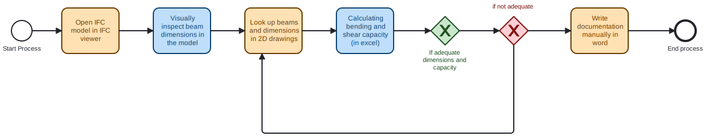
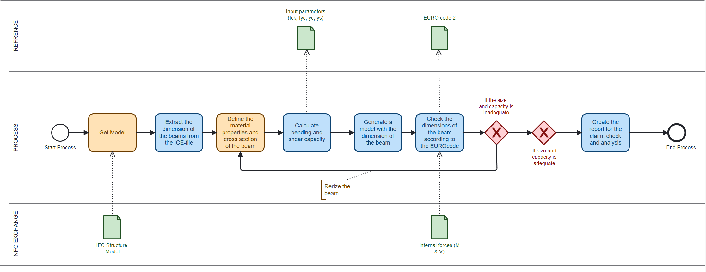

# About the tool
## What problem / claim is your tool solving?

The tool verifies a common structural claim:

“All reinforced concrete beams in the BIM model comply with the Eurocode 2 minimum width and minimum reinforcement requirements.”

In many ABI/ABD projects, this claim is made manually and without automatic validation. The tool automates the extraction of beam geometry from the IFC model and performs EC2 checks directly and consistently.

## Where did you find this problem?

During the ABI / Advanced Building Information workflow, we observed that:

Beam dimensions were checked manually using drawings or spreadsheets

EC2 minimum width and reinforcement checks were not linked to the BIM model

Structural claims in student reports lacked model-based evidence

There was no automatic process for validating beam requirements

This gap highlighted the need for an automated, model-driven verification tool.

# Description of the tool

## The tool is a Python script that:

Reads all IfcBeam elements from an IFC model

Extracts beam cross-section dimensions from:

Material profiles

Extruded solids

Type definitions

Name-based dimension patterns

Converts all values to millimetres

Performs Eurocode 2 minimum checks:

Minimum beam width (default 200 mm)

Minimum longitudinal reinforcement

Minimum shear resistance

Calculates:

As_min_mm2

M_Rd_kNm

V_Rd_c_kN

V_Rd_s_kN

Exports a full Excel file with all calculated results

# Advanced Building Design
Which ABD Stage (A, B, C, or D) is the tool useful for?

The tool is most useful in:

Stage C — Verification & Analysis

Stage C focuses on checking design requirements and validating project claims.
Automated EC2 checks support this stage directly.

It can also be beneficial in Stage D (Documentation), where transparent evidence is required.

# Instructions to run the tool

## Install required packages:

`pip install ifcopenshell pandas openpyxl`

Run the script from terminal:

`python beam_check_tool.py --ifc YourModel.ifc`

The tool generates an Excel file:

`YourModel.beam_check.xlsx`

containing all calculated EC2 results.

## Which subjects might use it?

The tool is relevant for subjects involving:

Structural Engineering

BIM-Based Analysis

Digital Construction

Concrete Structures

Eurocode Design

Model Checking and Automation

Integrated Design Workflows

Any discipline responsible for validating concrete beam requirements can use it.

# What information is required in the model for your tool to work?

## The IFC model must contain:

1. IfcBeam elements

The tool checks all beams in the model.

2. Cross-section geometry (at least one of the following):

IfcMaterialProfileSetUsage.Profile

IfcMaterialProfileSet.Profile

IfcExtrudedAreaSolid.SweptArea

Name-based dimensions (e.g. “300x450 mm”)

3. Unit assignment

A LENGTHUNIT defined in IfcUnitAssignment (either m or mm)

4. Identification

Each beam must have a valid GlobalId

5. Concrete and steel design assumptions

These values (fck, fyk, γc, γs) are defined inside the script, not in the IFC

With these minimal data requirements, the tool can execute all EC2 checks automatically.

# Process Diagrams
## Process Explanation

### As-Is Workflow (Manual)
The current ABD workflow relies on:
- Manually reading beam dimensions from drawings
- Entering values into spreadsheets
- Performing EC2 minimum checks by hand
- No connection between BIM model and documented claims

This process is time-consuming, error-prone and not traceable.

### To-Be Workflow (Automated with Our Tool)
The proposed workflow automates the entire verification process:

1. **Import IFC Model**  
   The script extracts all `IfcBeam` objects and identifies their cross-section.

2. **Extract Dimensions and Material Data**  
   The tool reads:
   - Profile dimensions  
   - SweptArea geometries  
   - Name-parsed dimensions when necessary  

3. **Run Eurocode Calculations**  
   The tool computes:
   - Minimum width check  
   - Minimum longitudinal reinforcement  
   - Minimum shear resistance  

4. **Generate Evidence File**  
   The script outputs an Excel file (`beam_results.xlsx`) containing:
   - Dimensions  
   - Status of EC2 width check  
   - Design resistances  
   - Data source (profile / type / name)

5. **Use in ABD Report**  
   The automatically generated results act as transparent, model-based evidence for structural safety claims.

This workflow eliminates manual checking and provides traceable, data-driven documentation.

# Conclusion

The tool automates Eurocode 2 checks for reinforced concrete beams by reading geometry directly from the IFC model. It replaces manual calculations with a fast, traceable, and model-based verification workflow. The generated Excel output provides clear evidence for structural requirements and supports efficient validation in the Advanced Building Design process.

